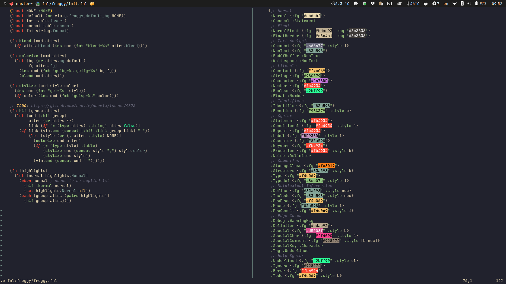
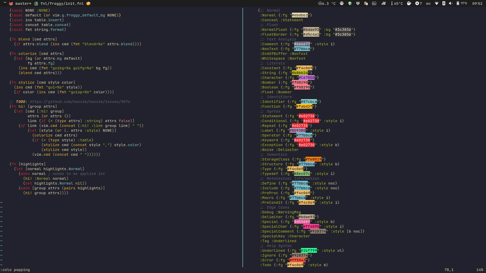

# Froggy

The original author of [this colorscheme](https://github.com/ajmwagar/vim-deus) is [@ajmwagar](https://github.com/ajmwagar).
[nvim-deus](https://github.com/theniceboy/nvim-deus) is generated by [Iron-E/nvim-highlite](https://github.com/Iron-E/nvim-highlite).
The theme in this repo is a strip down of the latter, plus my customization:

It also includes a [Popping and Locking](https://marketplace.visualstudio.com/items?itemName=hedinne.popping-and-locking-vscode) clone:

### Requirements

- Neovim 0.7+
- [Hotpot](https://github.com/rktjmp/hotpot.nvim)
